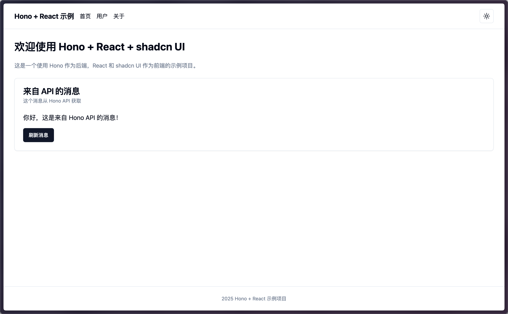
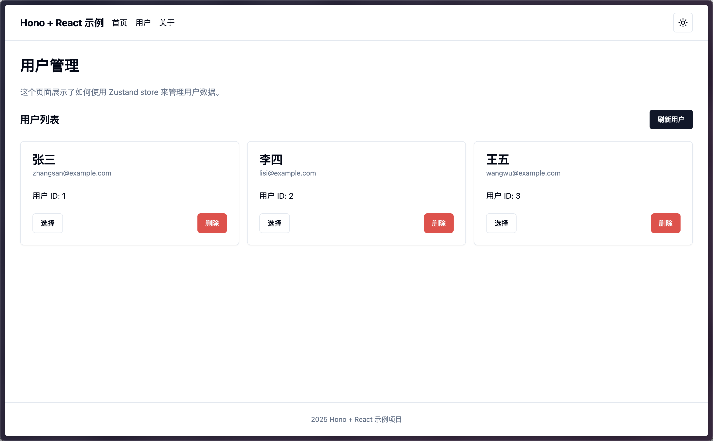
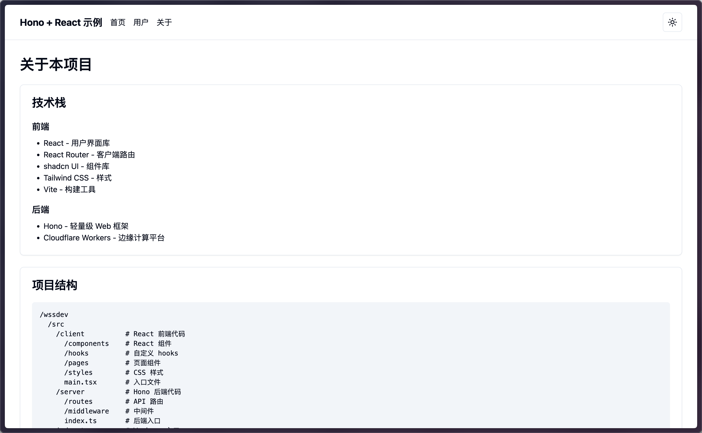

# Hono React Full-Stack Template

<p align="center">
  
</p>

<p align="center">
  <b>Modern, High-Performance Full-Stack Template for Cloudflare Workers</b>
</p>

<p align="center">
  <a href="#features">Features</a> •
  <a href="#screenshots">Screenshots</a> •
  <a href="#getting-started">Getting Started</a> •
  <a href="#project-structure">Project Structure</a> •
  <a href="#state-management">State Management</a> •
  <a href="#deployment">Deployment</a> •
  <a href="#customization">Customization</a>
</p>

<p align="center">
  <a href="./README.zh-CN.md">简体中文</a> | <b>English</b>
</p>

## Features

This template provides a complete solution for building modern full-stack applications using [Hono](https://hono.dev/) and [React](https://react.dev/), optimized for the Cloudflare Workers environment.

- ⚡️ **High Performance** - Lightweight, fast API routes based on Hono
- 🔄 **Full-Stack TypeScript** - Shared type definitions between frontend and backend for end-to-end type safety
- 🧩 **Component Library** - Integrated [shadcn/ui](https://ui.shadcn.com/) for beautiful and customizable UI components
- 📦 **State Management** - Clean and efficient state management with [Zustand](https://zustand-demo.pmnd.rs/)
- 🎨 **Theme Switching** - Built-in dark/light theme support with persistence
- 🔔 **Notification System** - Built-in notification system for friendly user feedback
- 📱 **Responsive Design** - Modern layout that adapts to various screen sizes
- 🚀 **One-Click Deployment** - Easy deployment to Cloudflare Workers

## Screenshots

### Home Page


### Users Management


### About Page


## Getting Started

### Prerequisites

- [Node.js](https://nodejs.org/) 18 or higher
- [npm](https://www.npmjs.com/) or [pnpm](https://pnpm.io/)
- [Wrangler CLI](https://developers.cloudflare.com/workers/wrangler/install-and-update/)

### Installation

```bash
# Create project using Cloudflare template
npm create cloudflare@latest

# Select "Template from a GitHub repo"
# Then type: https://github.com/zhangweiii/HonoReactStack

# Install dependencies
npm install

# Start the development server
npm run dev
```

Now, open [http://localhost:3000](http://localhost:3000) to view your application.

## Project Structure

```
/
├── src/
│   ├── client/           # Frontend React code
│   │   ├── components/   # React components
│   │   ├── hooks/        # Custom React hooks
│   │   ├── pages/        # Page components
│   │   ├── store/        # Zustand state management
│   │   └── styles/       # CSS style files
│   └── server/           # Backend Hono code
│       └── routes/       # API route definitions
├── public/               # Static assets
├── wrangler.jsonc        # Cloudflare Workers configuration
└── package.json          # Project dependencies and scripts
```

## State Management

This template uses Zustand for state management, providing three main stores:

### User Store

Manages user data, including fetching, adding, updating, and deleting users.

```tsx
import { useUserStore } from '@/store/userStore'

function Component() {
  const { users, fetchUsers, addUser } = useUserStore()
  
  // Use state and methods from the store
}
```

### Theme Store

Manages application theme settings, supporting light, dark, and system themes.

```tsx
import { useThemeStore } from '@/store/themeStore'

function Component() {
  const { theme, toggleTheme } = useThemeStore()
  
  // Use theme state and toggle method
}
```

### Notification Store

Manages in-app notifications, supporting different types of notifications (success, error, warning, info).

```tsx
import { useNotifications } from '@/components/Notifications'

function Component() {
  const { showSuccess, showError } = useNotifications()
  
  // Show notifications
  showSuccess('Operation successful')
  showError('An error occurred')
}
```

## Deployment

### Deploy to Cloudflare Workers

```bash
# Login to Cloudflare
npx wrangler login

# Deploy the application
npm run deploy
```

## Customization

### Adding New Pages

1. Create a new page component in the `src/client/pages` directory
2. Add a new route in `src/client/App.tsx`

### Adding New API Endpoints

1. Add a new route handler in `src/server/routes/api.ts`

### Modifying Themes

1. Edit the CSS variables in `src/client/styles/globals.css`

## Contributing

Pull Requests and Issues are welcome!

## License

MIT
